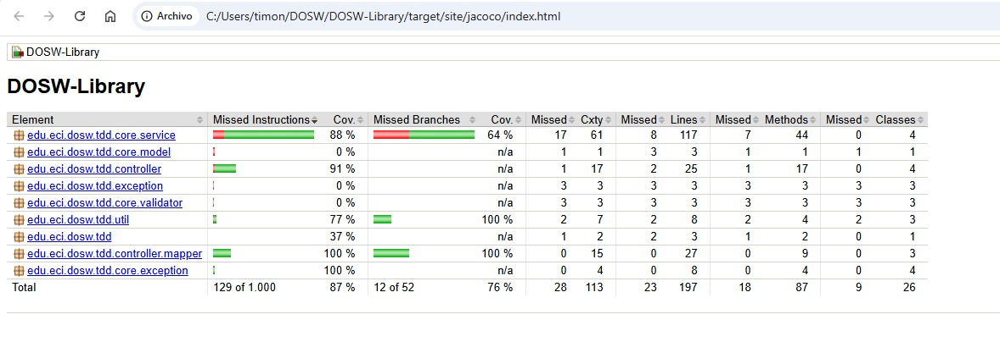

# DOSW-Library

Sistema de gestión de bibliotecas desarrollado como ejercicio práctico para la materia **DOSW 2** de la Escuela Colombiana de Ingeniería Julio Garavito.

---

## Descripción del problema

En DOSW Company se nos asignó un sistema de gestión de bibliotecas donde los usuarios pueden tomar prestados libros. El sistema gestiona los préstamos, verifica disponibilidad de ejemplares y mantiene un registro actualizado.

**Entidades principales:**
- **Book** — representa un libro disponible en la biblioteca (título, autor, ID, disponibilidad)
- **User** — persona registrada que puede solicitar préstamos (nombre, ID)
- **Loan** — préstamo de un libro a un usuario (libro, usuario, fecha de préstamo, fecha de devolución, estado)

**Funcionalidades:**
- Agregar libros y consultar disponibilidad
- Registrar usuarios y consultarlos
- Crear préstamos verificando que haya ejemplares disponibles
- Retornar libros y actualizar el estado del préstamo
- Manejo de errores cuando un libro no está disponible

---

## Arquitectura

El proyecto sigue una arquitectura en capas:

- **controller** — endpoints REST, DTOs
- **service** — lógica de negocio
- **model** — entidades del dominio
- **exception** — manejo de errores
- **util / validator** — validaciones y utilidades

---

## Diagrama General


---

## Diagrama Específico


---

## Diagrama de Clases


---

## Tecnologías usadas

- Java 17
- Spring Boot 4
- Lombok
- Swagger
- JaCoCo

---
## Cómo correr el proyecto

```bash
./mvnw spring-boot:run
```

Swagger UI disponible en:
```
http://localhost:8080/swagger-ui/index.html
```

---

## Pruebas

### Ejecutar pruebas y generar reporte de cobertura

```bash
./mvnw test jacoco:report
```


El reporte de cobertura queda en `target/site/jacoco/index.html`

### Cobertura - JaCoCo



Cobertura total: **87%**

### Análisis estático 

---

## Video de pruebas funcionales

Demostración de todos los endpoints con Swagger, simulando flujos de usuarios, libros y préstamos:

https://youtu.be/MNVlrl35fY0

---

## Endpoints disponibles

### Users
| Método | Endpoint | Descripción |
|--------|----------|-------------|
| POST | `/api/users` | Registrar un nuevo usuario |
| GET | `/api/users` | Obtener todos los usuarios |
| GET | `/api/users/{id}` | Obtener usuario por ID |

### Books
| Método | Endpoint | Descripción |
|--------|----------|-------------|
| POST | `/api/books` | Agregar un nuevo libro |
| GET | `/api/books` | Obtener todos los libros |
| GET | `/api/books/{id}` | Obtener libro por ID |

### Loans
| Método | Endpoint | Descripción |
|--------|----------|-------------|
| POST | `/api/loans` | Crear un préstamo |
| GET | `/api/loans` | Obtener todos los préstamos |
| GET | `/api/loans/{id}` | Obtener préstamo por ID |
| GET | `/api/loans/user/{userId}` | Obtener préstamos por usuario |
| PUT | `/api/loans/{id}/return` | Retornar un libro |